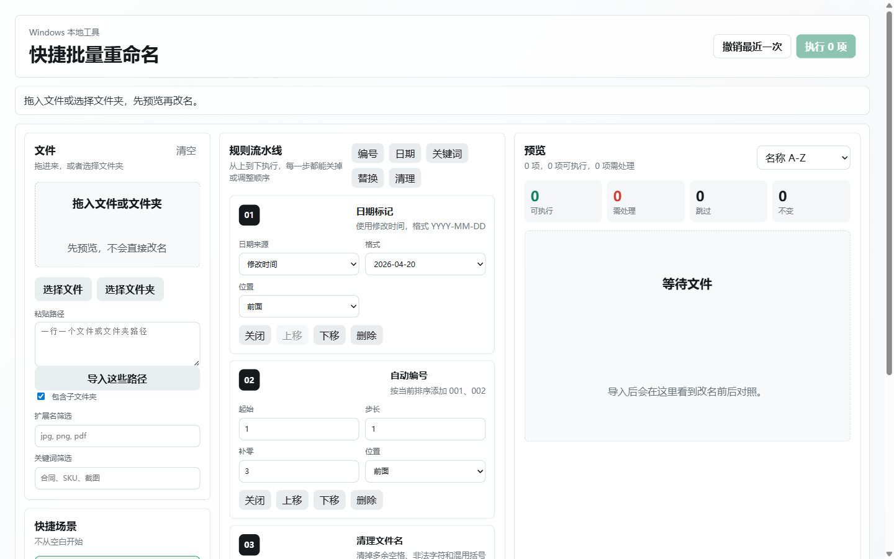
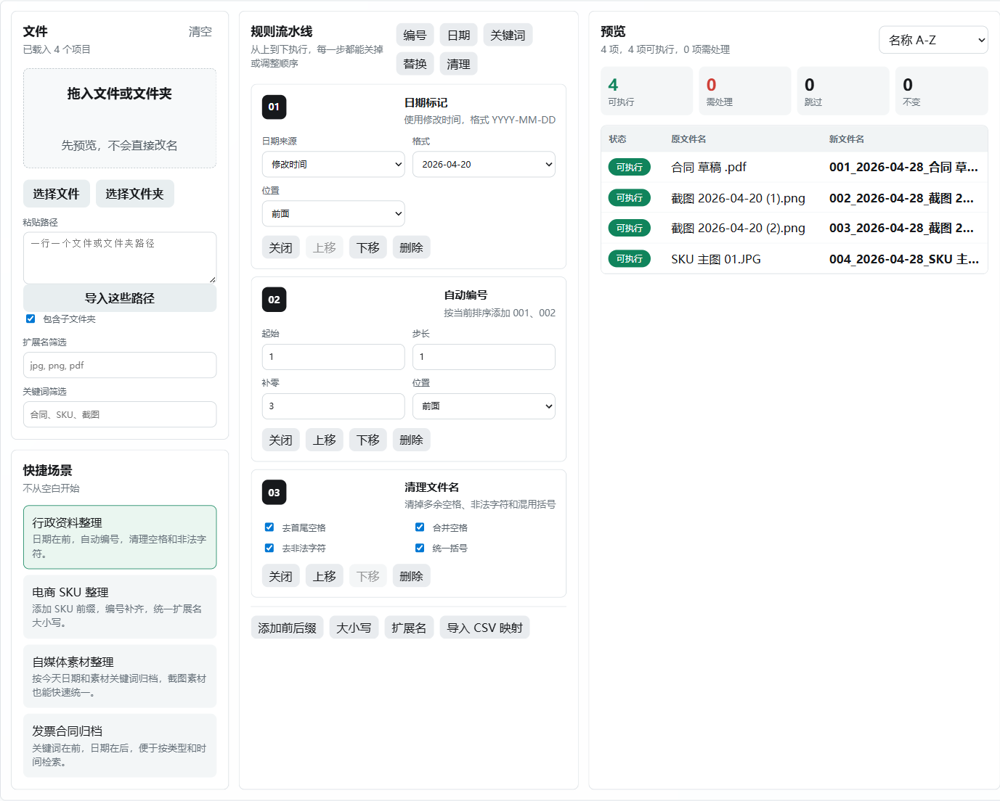
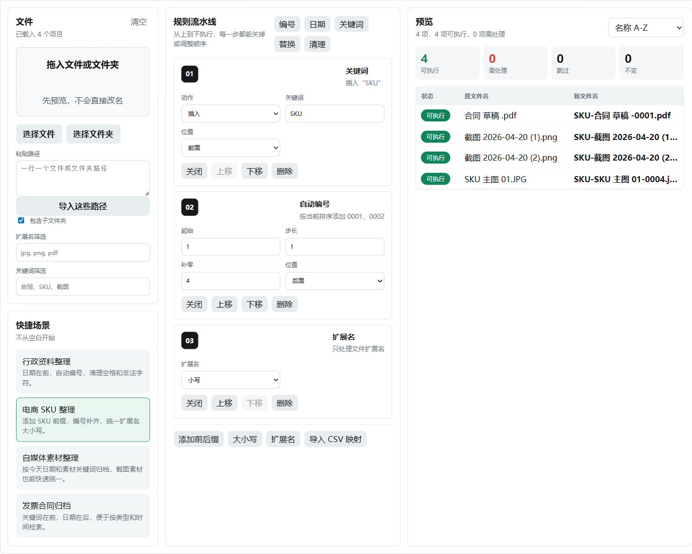
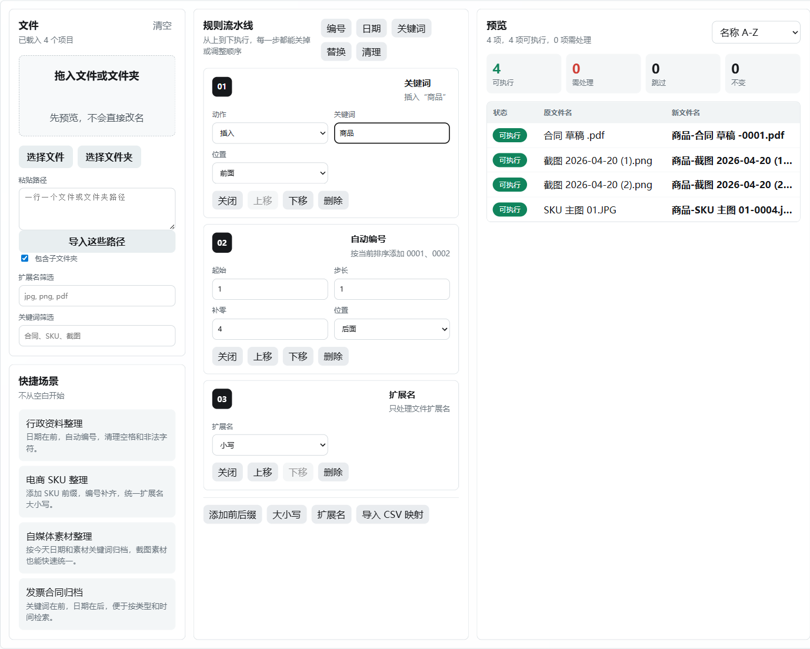
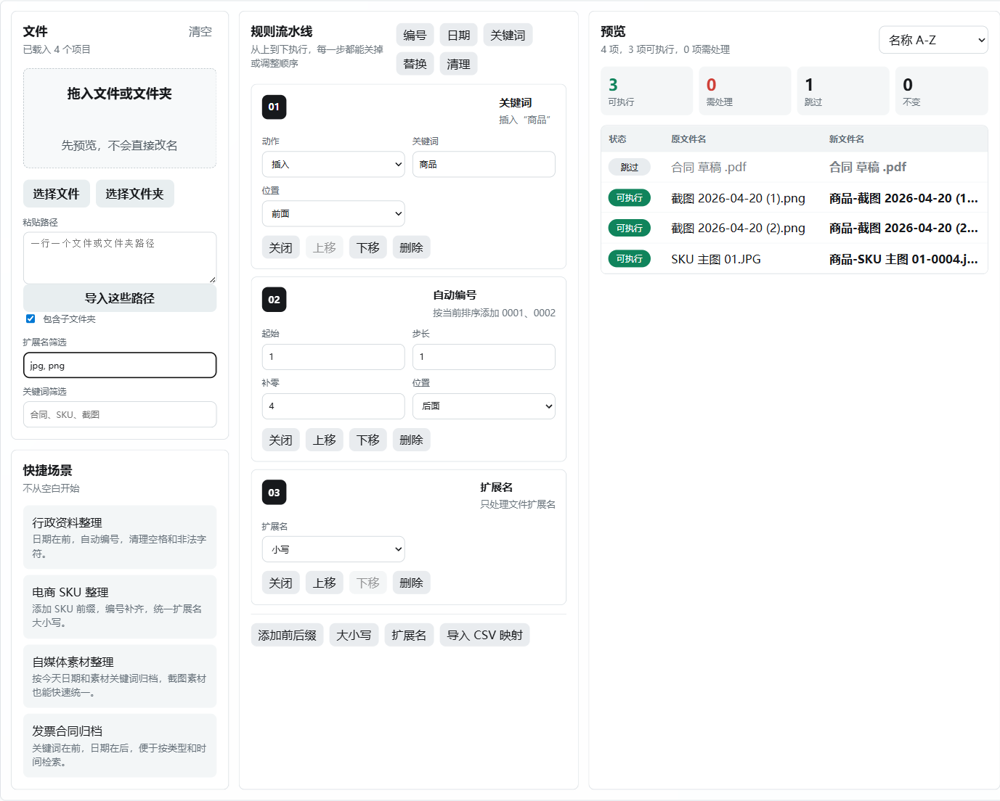

# 快捷批量重命名使用教程：先预览，再批量改名

`快捷批量重命名` 是一个面向 Windows 的本地文件批量重命名工具，适合行政资料、电商图片、自媒体素材、发票合同等文件整理场景。它的核心思路很简单：先导入文件，再配置规则，确认右侧预览无误后再执行真实改名。



## 适合解决什么问题

如果你经常遇到这些情况，这个工具会比较合适：

- 一堆截图、照片、合同、发票文件名混乱，需要统一加日期或编号。
- 电商主图、详情图、SKU 图需要按固定前缀和序号整理。
- 自媒体素材下载后名称不统一，需要按日期、关键词归档。
- 文件名里有多余空格、中文括号、Windows 不允许的符号，需要批量清理。
- 手工改名容易漏改、重名或覆盖，需要先看到改名前后对照。

## 第一步：导入要处理的文件

打开程序后，左侧是文件导入区。你可以用四种方式加入文件：

- 直接拖入文件或文件夹。
- 点击 `选择文件`，手动选择多个文件。
- 点击 `选择文件夹`，扫描一个文件夹中的文件。
- 在 `粘贴路径` 中输入路径，一行一个文件或文件夹，然后点击 `导入这些路径`。

如果勾选 `包含子文件夹`，选择文件夹时会递归扫描子目录。只想处理当前文件夹时，可以取消勾选。

导入后，右侧会立刻显示预览结果。注意，此时还没有真正改名。



## 第二步：先看右侧预览状态

右侧预览区会把每个文件分成几种状态：

- `可执行`：当前规则可以安全改名。
- `需处理`：存在重名、非法字符、空文件名、路径过长等问题，需要先调整。
- `跳过`：被筛选条件或规则跳过，不会改名。
- `不变`：规则执行后名称没有变化。

执行按钮旁边的数字表示本次会真正改名的数量。建议每次点击执行前，先扫一眼右侧的新文件名，尤其是编号、日期、扩展名是否符合预期。

## 第三步：选择一个快捷场景

左下角提供了几个内置场景，不需要从空白规则开始配置：

- `行政资料整理`：日期在前，自动编号，并清理空格和非法字符。
- `电商 SKU 整理`：添加 SKU 前缀，编号补齐，统一扩展名大小写。
- `自媒体素材整理`：按日期和素材关键词整理截图、图片、视频素材。
- `发票合同归档`：关键词在前、日期在后，适合财务归档检索。

点击场景后，中间的规则流水线会自动替换，右侧预览也会同步更新。



## 第四步：按需要调整规则流水线

中间区域是规则流水线，规则会从上到下依次执行。每条规则都可以关闭、上移、下移或删除。

常用规则包括：

- `编号`：给文件加 `001`、`002` 这类序号。排序方式会影响编号顺序。
- `日期`：可以使用今天、创建时间或修改时间，支持 `2026-04-28`、`20260428`、`2026_04_28` 等格式。
- `关键词`：插入、替换、删除或按关键词筛选文件。
- `替换`：普通文本替换，也支持正则表达式。
- `清理`：去首尾空格、合并空格、去非法字符、统一括号。
- `前后缀`：给文件名增加固定前缀或后缀。
- `大小写`：统一英文大小写。
- `扩展名`：保留、小写、大写或替换文件扩展名。
- `CSV 映射`：按表格指定每个文件的新名字。

例如，在电商场景中，把关键词从 `SKU` 改成 `商品` 后，右侧预览会马上展示新的文件名。



## 第五步：用筛选减少误操作

左侧的筛选区可以控制本次处理范围：

- `扩展名筛选`：例如输入 `jpg, png`，就只处理图片文件。
- `关键词筛选`：例如输入 `合同`，就只处理文件名包含“合同”的项目。

被筛选掉的文件会显示为 `跳过`，不会参与执行。这个功能适合在一个混合文件夹里只处理图片、PDF 或某类项目。



## 第六步：确认无误后执行

确认右侧预览后，点击右上角的 `执行 N 项`。程序会再次检查目标文件是否安全，避免覆盖已有文件。

执行后，如果发现结果不符合预期，可以点击 `撤销最近一次`。撤销功能针对最近一次执行记录生效，建议不要在中途手动移动或改名这些文件，否则撤销时可能找不到目标路径。

## CSV 映射：适合一对一改名

如果你已经在表格里整理好了旧文件名和新文件名，可以使用 `导入 CSV 映射`。CSV 至少包含两列：

```csv
原文件名,新文件名
old-a.txt,new-a.txt
old-b.txt,new-b.txt
```

使用时注意：

- `原文件名` 要和实际文件名匹配。
- `新文件名` 可以包含扩展名；如果没有写扩展名，工具会保留原扩展名。
- 导入后仍然要先看预览，确认没有重名或非法字符。

## 推荐工作流

日常使用可以按这个顺序来：

1. 选择文件夹或拖入文件。
2. 根据文件类型选择一个快捷场景。
3. 调整关键词、编号位数、日期格式等细节。
4. 必要时设置扩展名或关键词筛选。
5. 检查右侧预览中的 `可执行`、`需处理`、`跳过` 数量。
6. 确认新文件名后点击执行。
7. 如果结果不对，立即使用 `撤销最近一次`。

## 使用建议

- 第一次处理重要文件时，建议先复制一份文件夹做测试。
- 编号规则受排序方式影响，右上角可以切换 `名称 A-Z`、`名称 Z-A`、`最近修改优先`、`最早修改优先`。
- 如果右侧出现 `需处理`，不要强行执行，先根据提示修改规则。
- 批量改名后不要立刻删除原始备份，确认业务系统、素材库或归档目录都能正常识别后再清理。

这个工具最值得利用的是“实时预览”：只要把每一步规则调到右侧结果完全符合预期，再执行，批量重命名就会比手工操作更快，也更不容易出错。
